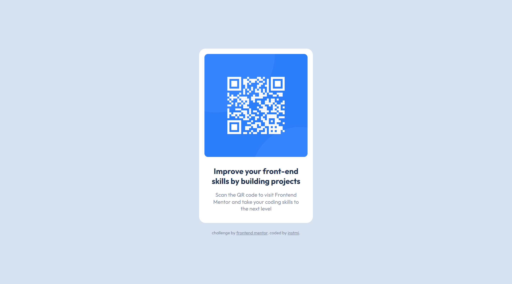

# Frontend Mentor - QR code component

## Desafio
Escolhi este desafio simples em HTML e CSS para testar e exercitar meus conhecimentos básicos, além de reconhecer e acessar quaisquer dificuldades.

## Processo
Para a marcação HTML, tentei manter o HTML semântico para a simplicidade do projeto. Para as classes, pensei no modelo BEM.

Escrevi o CSS principal com base no conceito mobile-first e usei media queries para ajustar alguns espaçamentos, larguras e entrelinhas em telas a partir de 1040px.

## Conhecimentos
- HTML;
- CSS (flexbox, media queries);

## Minha solução

- [Visualização em página](https://instmi.github.io/qr-code-component-main/)

## Autora
- [@ Frontend Mentor](https://www.frontendmentor.io/profile/instmi)
